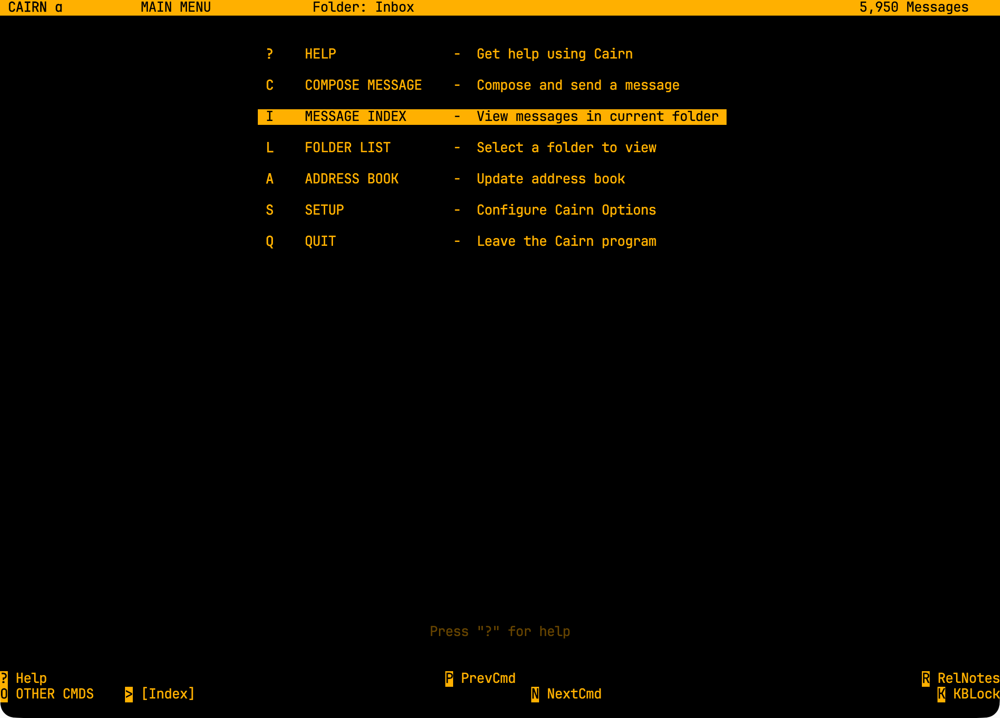
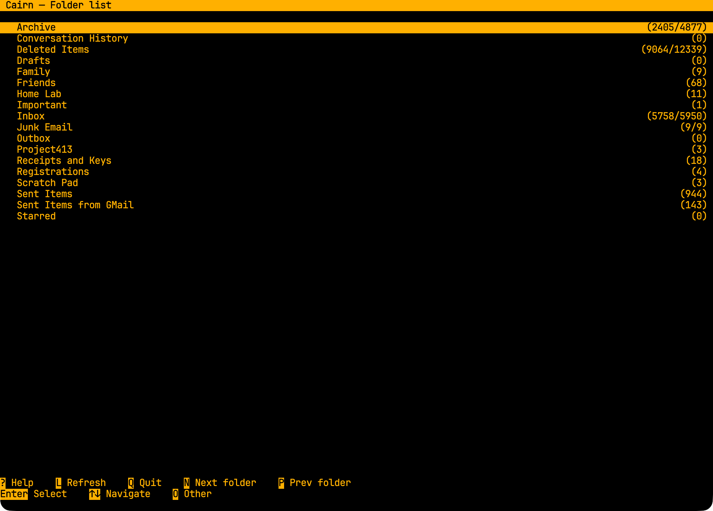
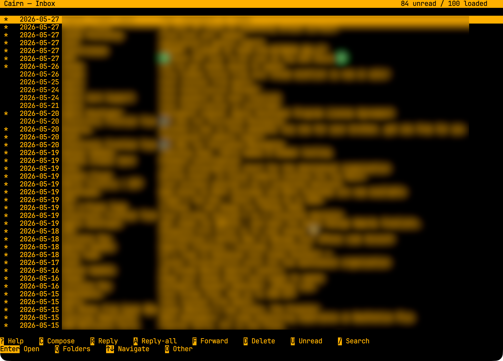
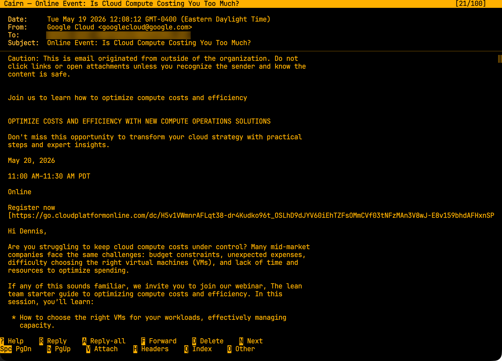
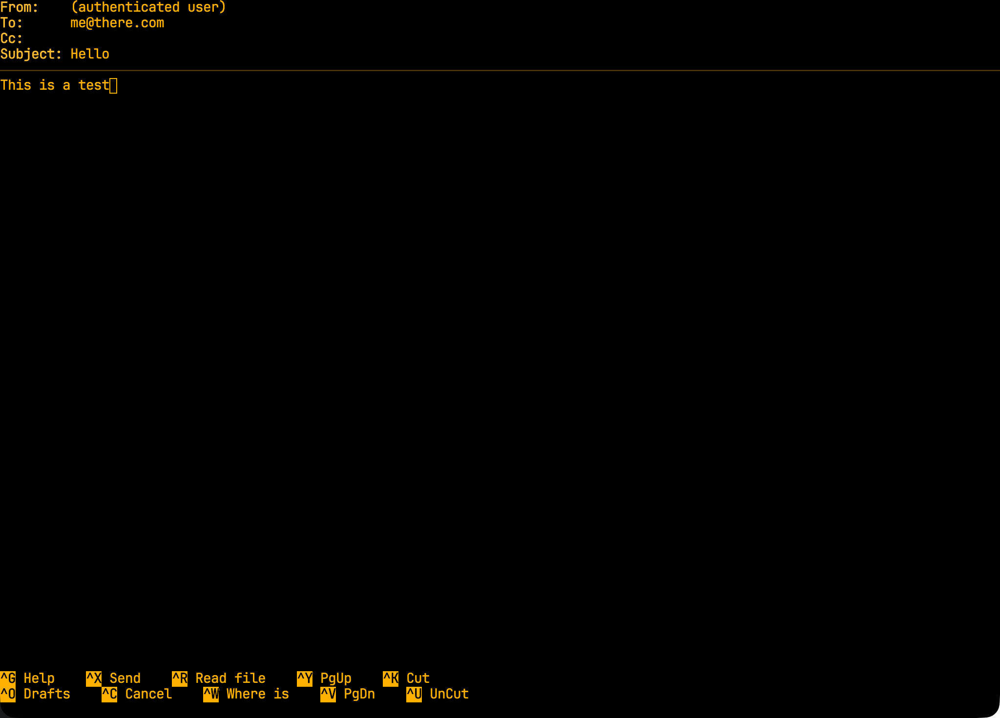
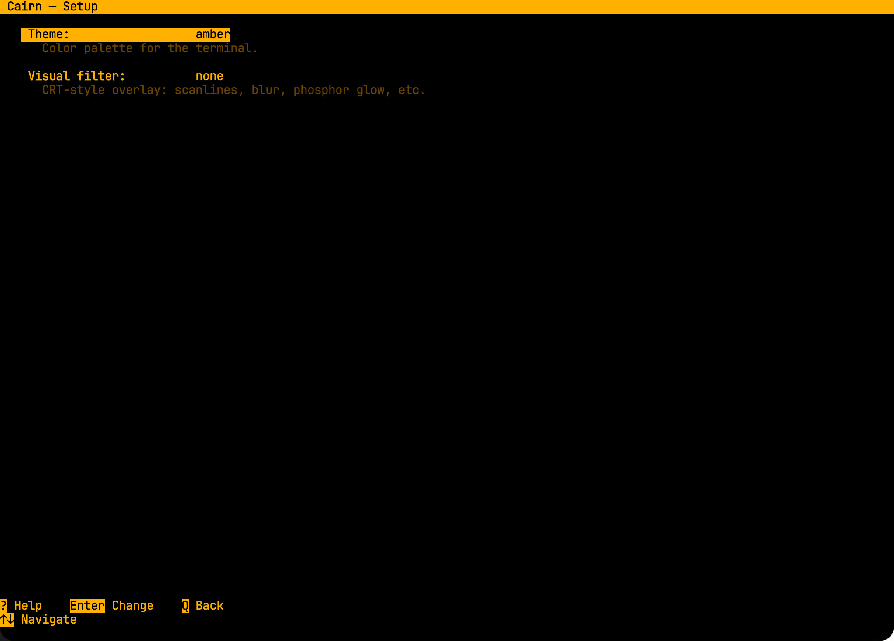

# Cairn

A keyboard-driven desktop mail client in the spirit of Alpine. Cross-platform Electron app with an xterm.js terminal UI. Plain text first. No remote content. Microsoft Graph today, IMAP next.

## Status

Alpha. The full menu / folderlist / index / view / compose / search / help / setup flow works against Microsoft 365. Packaged installers (`make package`) build on macOS, Windows, and Linux. IMAP provider is the only remaining spec item.

## Screenshots

| | |
|---|---|
|  |  |
|  |  |
|  |  |

## Features

- **All five Alpine-style screens**: main menu, folder list, message index, view, compose. Plus context-sensitive help (`?` anywhere), global search (`/` on index), and a Setup screen for theme and visual-filter selection.
- **Five themes**: classic (green-on-black phosphor), amber, paper, solarized-dark, solarized-light. Switch under Setup → Theme with live preview.
- **CRT-style visual filters**: none, scanlines, blur, phosphor glow. Setup → Visual filter.
- **Bundled monospace fonts**: JetBrains Mono and IBM Plex Mono ship inside the app so the terminal looks the same on every platform.
- **Local cache**: SQLite holds folders and message headers. Reads return from cache; sync runs in the background. Polls the inbox and the currently-viewed folder.
- **Composes plain text**: To / Cc / Subject / Body with `^X` send, `^O` save draft, `^C` cancel. Reply / reply-all / forward from the index or the view screen — quote prefix, attribution line, and `Re:` / `Fwd:` subject handling per Alpine convention.
- **HTML-free**: incoming HTML is sanitized (strict allowlist — no ``, no inline CSS or JS) and converted to text via `html-to-text`. No remote URLs are ever fetched on the user's behalf.
- **Encrypted token storage**: OAuth refresh tokens stored via Electron `safeStorage` (Keychain on macOS, DPAPI on Windows, libsecret on Linux). Re-auth flow surfaces a dedicated screen if the token can't be silently refreshed.
- **Save attachments to disk**: `V` on the view screen opens an attachment picker; Enter saves the selected attachment via the OS save dialog.

## Stack

- Electron + TypeScript (main / preload / renderer split)
- xterm.js with WebGL renderer, fit and web-links addons
- `better-sqlite3` for the local cache (sync API, native module)
- `@azure/msal-node` for OAuth (PKCE + loopback redirect)
- Electron `safeStorage` for at-rest token encryption
- `sanitize-html` + `html-to-text` for inbound HTML
- Raw `fetch` + a thin typed wrapper for Microsoft Graph (no SDK)
- `electron-vite` for the dev/build pipeline; `electron-builder` for packaging
- `vitest` for unit tests, `playwright` for renderer integration (planned)

## Build and run

Prerequisites: Node 20+, macOS / Windows / Linux. Apple Silicon: works natively; Intel macOS also builds.

```bash
make install        # npm install + native module rebuild against Electron
make dev            # launches the app under electron-vite in dev mode
make build          # compiles main / preload / renderer bundles
make typecheck      # tsc --noEmit for both node and web tsconfigs
make package        # full installer build for the current platform
```

`make package` produces `dist/Cairn-<version>-<arch>.dmg` on macOS (plus a `.zip`), NSIS `.exe` + portable `.zip` on Windows, and `.AppImage` + `.deb` on Linux.

## Configuration

Cairn talks to Microsoft Graph and needs an Entra ID app registration. The free Microsoft account flow takes about five minutes — see [docs/azure-setup.md](docs/azure-setup.md) for the exact portal steps.

The default app registration in `src/main/auth/config.ts` is configured for multi-tenant + personal Microsoft accounts. Override at runtime via environment variables:

```bash
export CAIRN_AZURE_CLIENT_ID='your-app-client-id'
export CAIRN_AZURE_TENANT_ID='your-tenant-id'   # or 'common' for multi-tenant
```

Themes and visual filters persist in Cairn's local SQLite database under `app.getPath('userData')/cairn.db`.

## Design principles

1. **Keyboard-first.** No mouse required for any operation.
2. **Plain text mail.** HTML is sanitized and converted to text. No inline images. **No remote content loading, ever.**
3. **Provider-agnostic core.** One `MailProvider` interface, swappable implementations.
4. **One binary per platform.** No server, no Docker, no certs.
5. **Local-first cache.** SQLite holds folders, headers, bodies. Network is for sync, not for reads.

The full spec lives in [docs/SPEC.md](docs/SPEC.md).

## Attribution

The interface is modeled on [Alpine](https://alpineapp.email/), the University of Washington's terminal mail client. Alpine is licensed Apache 2.0; Cairn is also licensed Apache 2.0. Cairn is implemented fresh in TypeScript and references Alpine's source as a reference for menu flows, screen layouts, key handling, and edge cases. Where a Cairn routine is closely modeled on a specific Alpine routine, the source is noted inline. The name "Alpine" belongs to UW and is not used in any Cairn branding, package name, or user-facing string.

Bundled monospace fonts:

- **JetBrains Mono** by JetBrains s.r.o., SIL Open Font License 1.1
- **IBM Plex Mono** by IBM, SIL Open Font License 1.1

See [NOTICE](NOTICE) for the full attribution notices.

## License

[Apache 2.0](LICENSE).
